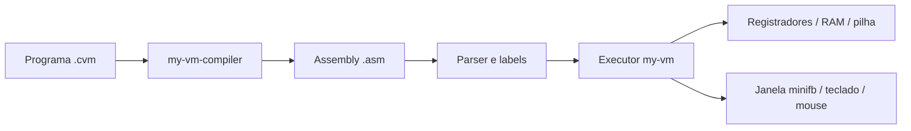

# my-vm

Máquina virtual experimental em Rust para executar o Assembly do ecossistema CVM. O projeto permite estudar uma arquitetura própria: instruções, registradores, memória, pilha, interrupções e uma interface gráfica controlada pelo programa convidado.

## Como funciona



`src/main.rs` lê o arquivo, `src/parser/mod.rs` converte instruções e labels, e `src/machine/executor.rs` executa os opcodes alterando `Machine`. O processo roda no sistema operacional hospedeiro. O hardware do convidado é simulado.

- 26 registradores `u32`, endereçados por `A` a `Z`.
- RAM com `256 * 1024 * 1024` palavras de 32 bits: cerca de **1 GiB**, além da VRAM e demais estruturas. Os endereços representam palavras.
- Framebuffer de **1280 × 800** pixels armazenados em `u32`, janela `minifb`, primitivas de desenho e texto com `font8x8`.
- Mouse, teclado, 1024 portas de I/O e interrupções simuladas. Os eventos usam os vetores 32 (timer), 33 (teclado) e 34 (Alt+Tab).
- Operações aritméticas, desvios, chamadas, pilha e acesso à memória. Consulte [opcodes](src/opcodes.rs), [parser](src/parser/mod.rs) e [ISA](ISA.md); a implementação é a referência para instruções recentes.

## Executar

Requer Rust com suporte à edição 2024, Cargo e uma sessão gráfica com os requisitos nativos de `minifb` disponíveis. A inicialização cria uma janela mesmo para programas pequenos; não há modo headless configurável.

```bash
git clone https://github.com/emanuelVINI01/my-vm.git
cd my-vm
cargo build --release --bin my-vm
cargo run --release --bin my-vm -- programa.asm
```

O `--bin my-vm` é necessário porque o pacote também contém o utilitário `bin_scancode`.

Um exemplo mínimo de `programa.asm`:

```asm
SET A 10;
SET B 20;
ADD A B;
HALT;
```

Para executar o sistema experimental, organize os três repositórios como diretórios irmãos e use os comandos do [my-vm-os](https://github.com/emanuelVINI01/my-vm-os).

## Organização e limites

| Caminho | Responsabilidade |
| --- | --- |
| `src/instruction.rs` | Instruções e operandos |
| `src/opcodes.rs` | Conjunto de operações |
| `src/parser/` | Assembly textual e labels |
| `src/machine/machine.rs` | Memória e dispositivos gráficos |
| `src/machine/executor.rs` | Execução e interrupções |
| `src/bin_scancode.rs` | Inspeção de códigos de teclado |
| `tests/` | Testes Python históricos que dependem de binário e layout antigos |

É um runtime de estudo. Os testes históricos não comprovam que o desktop ou todos os opcodes atuais funcionam. Não há benchmark que sustente a antiga afirmação de alto desempenho. Para verificar a compilação dos binários sem abrir a janela:

```bash
cargo check --locked --bins
```

## Projetos relacionados

- [my-vm-compiler](https://github.com/emanuelVINI01/my-vm-compiler): linguagem CVM, IR e geração de Assembly.
- [my-vm-os](https://github.com/emanuelVINI01/my-vm-os): desktop e aplicativos em CVM, executados nesta VM.
- `old_compiler`: protótipo anterior que transpila um subconjunto de Python; incompatibilidades com a ISA atual estão documentadas no seu README.

Licença MIT: [LICENSE](LICENSE).
